

<!-- Aurora Hero Banner -->
<picture>
  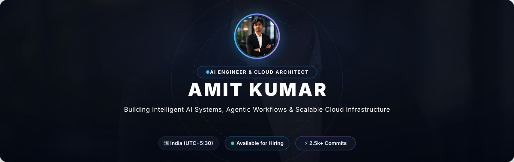
</picture>

  

<!-- Interactive Console Terminal -->
<picture>
  
</picture>

  

<!-- Engineering Certifications & Honors -->
<picture>
  
</picture>

  

<!-- Core Technology & Infrastructure Ecosystem -->
<picture>
  
</picture>

  

<!-- Core Focus & Capabilities -->
<picture>
  
</picture>

  

<!-- System Architecture Blueprint -->
<picture>
  
</picture>

  

<!-- Engineering Competency Radar -->
<picture>
  
</picture>

  

<!-- Daily Engineering Routine -->
<picture>
  
</picture>

  

<!-- Detailed Biography & Overview -->

### 🌌 About Me

> **Senior AI Engineer & Cloud Architect** specializing in building high-performance AI systems, agentic LLM workflows, and resilient cloud microservices.

- 🔭 **Currently Building**: Production Agentic RAG Pipelines, Fine-tuning Open Source Models (Llama 3, Mistral), and Cloud-Native Infrastructure.
- ⚡ **Core Strengths**: Deep Learning, Vector Search Optimization, High-Availability Systems, Full-Stack Architecture.
- 📍 **Location**: India 🇮🇳 (UTC+5:30)
- 💬 **Ask Me About**: PyTorch, LangChain, FastAPI, Docker, Kubernetes, AWS, System Architecture.

 

<!-- Core Proficiency & Skill Breakdown -->
<picture>
  
</picture>

  

<!-- Technical Expertise Matrix -->
<picture>
  
</picture>

  

<!-- Featured Projects -->
<picture>
  
</picture>

  

<!-- GitHub Dashboard -->

  
  &nbsp;&nbsp;
  

 

  

  

<!-- Contribution Matrix (Snake Animation) -->

  <picture>
    <source media="(prefers-color-scheme: dark)" srcset="https://raw.githubusercontent.com/Amit123103/Amit123103/output/github-contribution-grid-snake-dark.svg">
    <source media="(prefers-color-scheme: light)" srcset="https://raw.githubusercontent.com/Amit123103/Amit123103/output/github-contribution-grid-snake.svg">
    
  </picture>

  

<!-- 3D Isometric Contribution Grid -->

  <picture>
    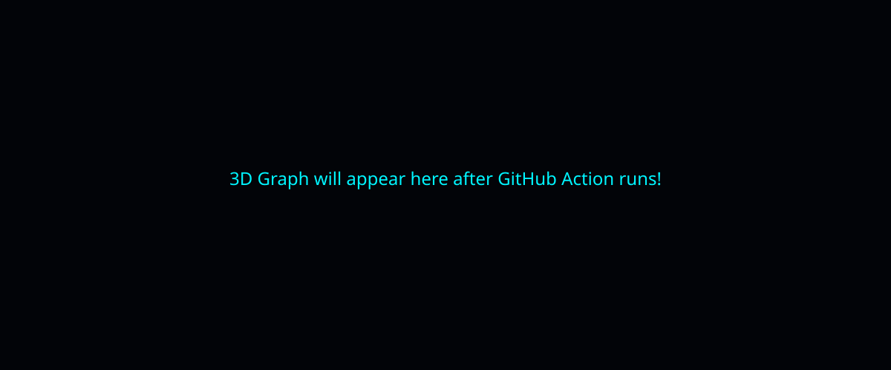
  </picture>

  

<!-- Animated Mascots -->

  
  &nbsp;&nbsp;&nbsp;&nbsp;
  

  

<!-- Quick Connect & Collaboration Cards -->
<picture>
  
</picture>

  

<!-- Social Galaxy -->

  
  &nbsp;&nbsp;
  
  &nbsp;&nbsp;
  
  &nbsp;&nbsp;
  

  

<!-- Aurora Footer -->
<picture>
  
</picture>

