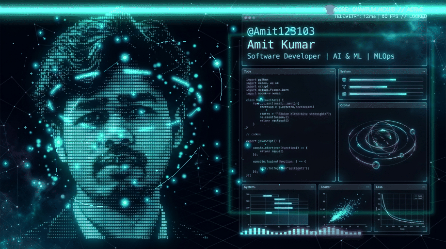

<!-- ═══════════════════════════════════════════════════════════════
     🌌 AMIT KUMAR — ULTIMATE 3D MOTION GITHUB PROFILE v5.0
     Holographic · Isometric · Cinematic · Professional
     ═══════════════════════════════════════════════════════════════ -->

<!-- 🎬 3D Cinematic Hero — Animated Terminal Profile Artwork -->
<picture>
  <source type="image/webp" srcset="assets/terminal_profile_3d.webp">
  
</picture>

  

<!-- ✨ Holographic Floating Greeting Capsule -->

  <table border="0" cellpadding="0" cellspacing="0" style="background: linear-gradient(135deg, rgba(8, 14, 32, 0.85), rgba(15, 23, 42, 0.95)); border: 1.5px solid rgba(0, 245, 255, 0.25); border-radius: 50px; padding: 10px 36px; box-shadow: 0 8px 32px rgba(0, 245, 255, 0.12);">
    <tr>
      <td align="center" valign="middle">
        
        &nbsp;&nbsp;&nbsp;
        
        &nbsp;&nbsp;&nbsp;
        
        &nbsp;&nbsp;&nbsp;
        
        &nbsp;&nbsp;&nbsp;
        
        &nbsp;&nbsp;&nbsp;
        
        &nbsp;&nbsp;&nbsp;
        
      </td>
    </tr>
  </table>

  

<!-- ⚡ 3D Holographic Interactive Terminal Console -->
<picture>
  
</picture>

  

<!-- 🏆 Engineering Certifications & Honors — 3D Floating Cards -->
<picture>
  
</picture>

  

<!-- 🔧 Core Technology & Infrastructure Ecosystem -->
<picture>
  
</picture>

  

<!-- 🎯 Core Focus & Capabilities — 3D Info Panels -->
<picture>
  
</picture>

  

<!-- 🏗️ System Architecture Blueprint -->
<picture>
  
</picture>

  

<!-- 📊 Engineering Competency Radar -->
<picture>
  
</picture>

  

<!-- ⏰ Daily Engineering Routine — 3D Timeline -->
<picture>
  
</picture>

  

<!-- 📝 Detailed Biography & Overview -->

###  About Me

> **Software Developer | AI & ML | MLOps** specializing in building high-performance AI systems, agentic LLM workflows, and resilient full-stack applications.

- 🔭 **Currently Building**: **MyKernel**, **AI-HUMANIZER-PRO**, and **AI-Interviewer**.
- ⚡ **Core Strengths**: Deep Learning, Vector Search & Vector DBs, RAG & Agentic AI, Cloud-Native Infrastructure, MLOps.
- 📍 **Location**: India 🇮🇳 (UTC+5:30)
- 💬 **Ask Me About**: Python, C++, Java, JavaScript, Docker, Kubernetes, Linux, FastAPI, React, Next.js.

 

<!-- 📈 Core Proficiency & Skill Breakdown — 3D Radial Rings -->
<picture>
  
</picture>

  

<!-- 🧠 Technical Expertise Matrix — 3D Animated Bars -->
<picture>
  
</picture>

  

<!-- 🚀 Featured Projects — 3D Floating Holographic Cards -->
<picture>
  
</picture>

  

<!-- 📊 GitHub Stats Dashboard -->

  
  &nbsp;&nbsp;
  

 

  

  

<!-- 🐍 Contribution Matrix Snake Animation -->

  <picture>
    <source media="(prefers-color-scheme: dark)" srcset="https://raw.githubusercontent.com/Amit123103/Amit123103/output/github-contribution-grid-snake-dark.svg">
    <source media="(prefers-color-scheme: light)" srcset="https://raw.githubusercontent.com/Amit123103/Amit123103/output/github-contribution-grid-snake.svg">
    
  </picture>

  

<!-- 📐 3D Isometric Contribution Grid -->

  <picture>
    
  </picture>

  

<!-- 🤝 Connect & Collaborate — 3D Holographic CTA -->
<picture>
  
</picture>

  

<!-- 🌐 Social Network Galaxy -->

  
  &nbsp;&nbsp;
  
  &nbsp;&nbsp;
  
  &nbsp;&nbsp;
  

  

<!-- 🌌 Cinematic Footer -->
<picture>
  
</picture>

