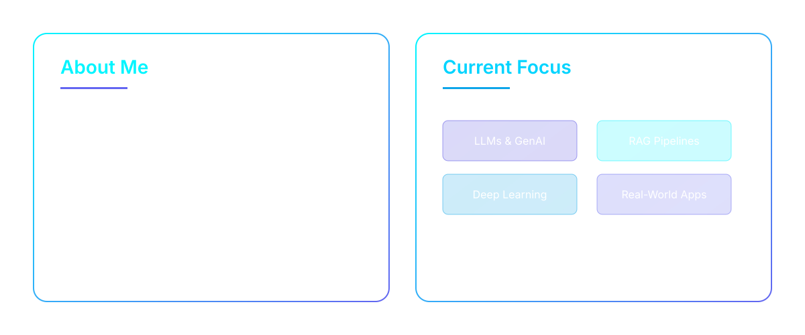

# Amit Kumar - AI & Machine Learning Engineer

<picture>
  
</picture>

---

## ⚡ Current Focus & About Me

<picture>
  
</picture>

---

## 🚀 Tech Stack Mastery

<picture>
  
</picture>

---

## 📊 GitHub Analytics & Achievements

<!-- Using public Vercel APIs with a custom neon theme to match our aesthetic -->

  
  

 

  

---

## 🐍 Contribution Snake Animation

  <!-- When the GitHub action runs, it will place the generated snake GIF here -->
  <!-- You can replace 'Amit123103' with your actual github username below after running the workflow -->
  <picture>
    <source media="(prefers-color-scheme: dark)" srcset="https://raw.githubusercontent.com/Amit123103/Amit123103/output/github-contribution-grid-snake-dark.svg">
    <source media="(prefers-color-scheme: light)" srcset="https://raw.githubusercontent.com/Amit123103/Amit123103/output/github-contribution-grid-snake.svg">
    
  </picture>

---

## 🌐 Connect With Me

  
  
  
  

 

<!-- Visitor Counter -->

  

---

<picture>
  
</picture>

