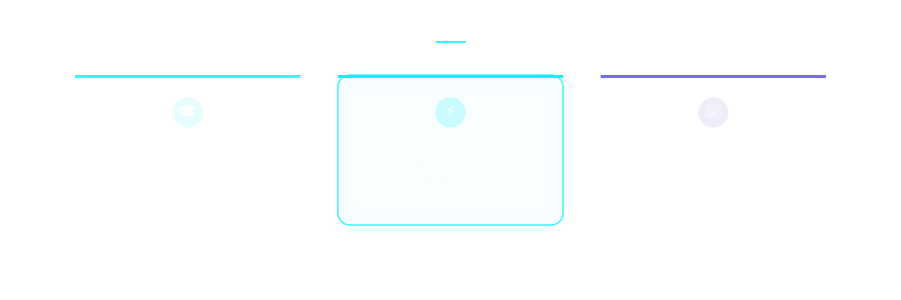
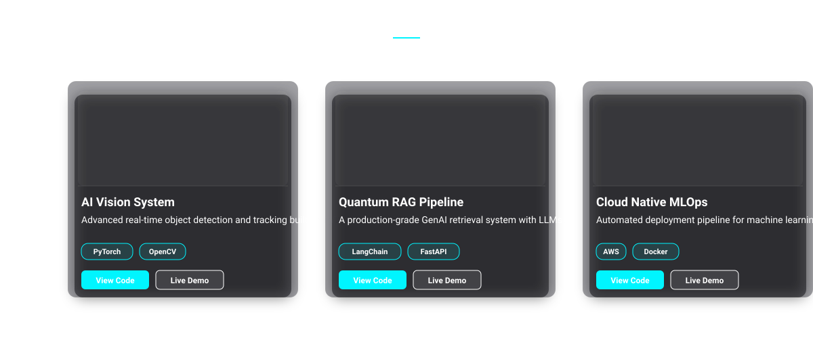

<!-- Zenith Core Hero Section -->
<picture>
  
</picture>

  

<!-- Zenith About / Data Grid -->
<picture>
  
</picture>

  

<!-- Zenith Skill Capsules -->
<picture>
  
</picture>

  

<!-- Zenith Project Cards -->
<picture>
  
</picture>

  

<!-- Perfectly Aligned GitHub Dashboard -->

  
  &nbsp;&nbsp;
  

 

  

  

<!-- Matrix Energy Dragon (Contributions) -->

  <picture>
    <source media="(prefers-color-scheme: dark)" srcset="https://raw.githubusercontent.com/Amit123103/Amit123103/output/github-contribution-grid-snake-dark.svg">
    <source media="(prefers-color-scheme: light)" srcset="https://raw.githubusercontent.com/Amit123103/Amit123103/output/github-contribution-grid-snake.svg">
    
  </picture>

  

<!-- 3D Contribution Calendar -->

  <picture>
    
  </picture>

  

<!-- Animated Mascots -->

  
  &nbsp;&nbsp;&nbsp;&nbsp;
  

  

<!-- Social Galaxy -->

  
  &nbsp;&nbsp;
  
  &nbsp;&nbsp;
  
  &nbsp;&nbsp;
  

  

<!-- Zenith Memory Carousel Footer -->
<picture>
  
</picture>

