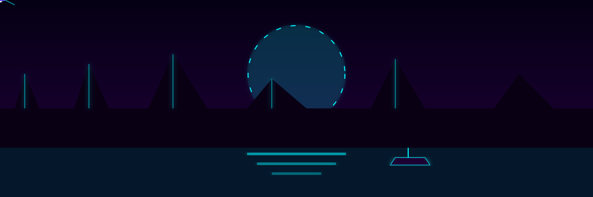

<picture>
  
</picture>

<picture>
  
</picture>

<!-- Digital Stats Control Center -->

  
  

 

  

---

## 🐉 Cyber Dragon (Contribution Matrix)

  <picture>
    <source media="(prefers-color-scheme: dark)" srcset="https://raw.githubusercontent.com/Amit123103/Amit123103/output/github-contribution-grid-snake-dark.svg">
    <source media="(prefers-color-scheme: light)" srcset="https://raw.githubusercontent.com/Amit123103/Amit123103/output/github-contribution-grid-snake.svg">
    
  </picture>

---

<picture>
  
</picture>

