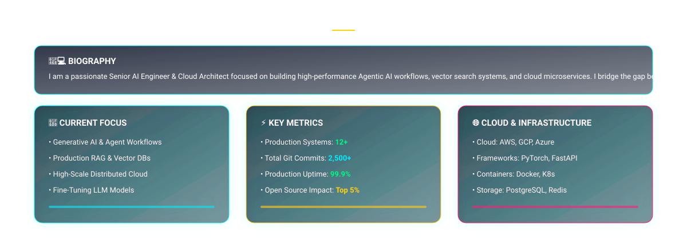
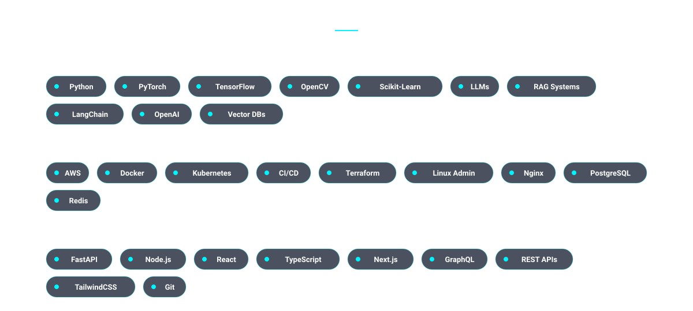

<!-- Quantum Core Hero Section -->
<picture>
  
</picture>

  

<!-- Quantum System Telemetry & About Me -->
<picture>
  
</picture>

  

<!-- Detailed Markdown Biography & Overview -->

### 🌌 About Me

> **Senior AI Engineer & Cloud Architect** with a passion for designing production-grade AI systems, intelligent agentic workflows, and high-performance cloud infrastructure.

- 🔭 **Currently Working On**: Agentic RAG Pipelines, Fine-tuning Open-Source LLMs (Llama 3, Mistral), and Distributed Cloud Microservices.
- ⚡ **Core Strengths**: Deep Learning, Vector Search Optimization, High-Availability Cloud Architecture, Full-Stack Engineering.
- 📍 **Location**: India 🇮🇳 (UTC+5:30)
- 💬 **Ask Me About**: PyTorch, LangChain, FastAPI, Docker, Kubernetes, AWS, System Architecture.

 

<!-- Quantum Technical Expertise Matrix -->
<picture>
  
</picture>

  

<!-- Quantum Featured Projects -->
<picture>
  
</picture>

  

<!-- Perfectly Aligned GitHub Dashboard -->

  
  &nbsp;&nbsp;
  

 

  

  

<!-- Matrix Energy Dragon (Contributions) -->

  <picture>
    <source media="(prefers-color-scheme: dark)" srcset="https://raw.githubusercontent.com/Amit123103/Amit123103/output/github-contribution-grid-snake-dark.svg">
    <source media="(prefers-color-scheme: light)" srcset="https://raw.githubusercontent.com/Amit123103/Amit123103/output/github-contribution-grid-snake.svg">
    
  </picture>

  

<!-- 3D Isometric Contribution Matrix -->

  <picture>
    
  </picture>

  

<!-- Animated Mascots -->

  
  &nbsp;&nbsp;&nbsp;&nbsp;
  

  

<!-- Social Galaxy -->

  
  &nbsp;&nbsp;
  
  &nbsp;&nbsp;
  
  &nbsp;&nbsp;
  

  

<!-- Quantum Footer Carousel -->
<picture>
  
</picture>

