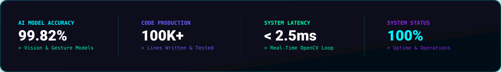
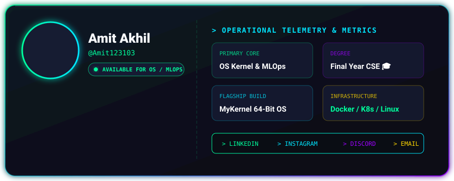
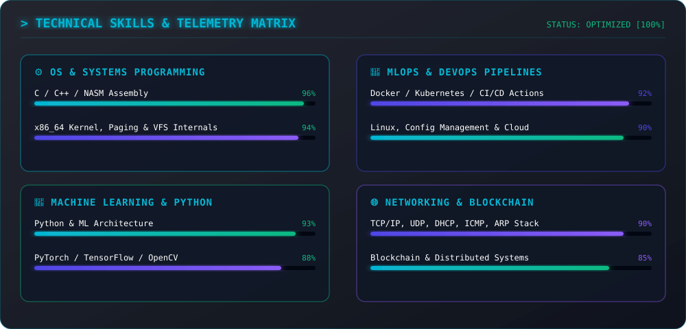
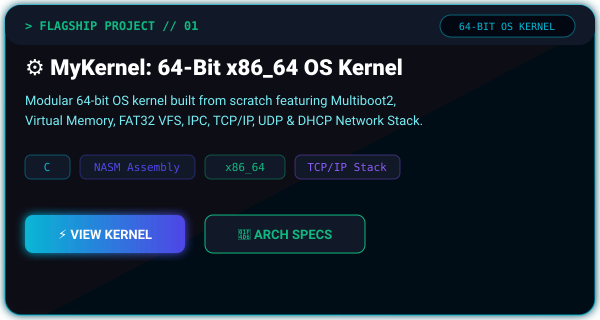
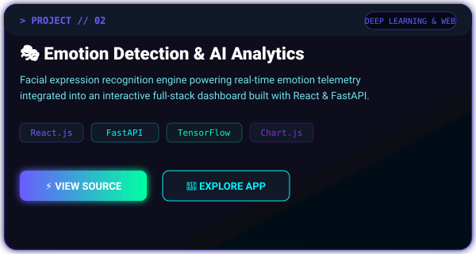
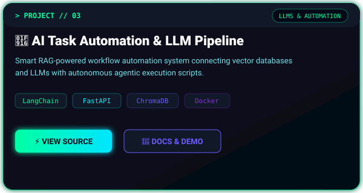
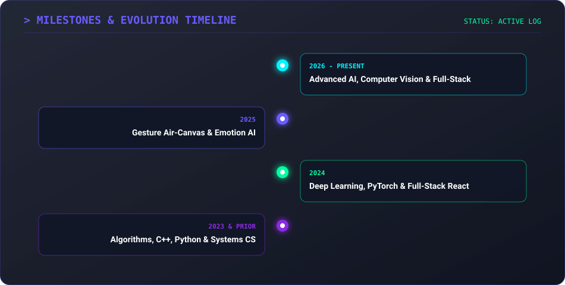

<!-- =================================================================================== -->
<!-- ⚡ VIRTUAL 3D AI OPERATING SYSTEM - GITHUB PROFILE README                            -->
<!-- Architecture Designed for Amit Akhil (@Amit123103)                                   -->
<!-- Theme: Luxury Glassmorphism | Midnight Graphite | Cyan, Indigo & Emerald Glow        -->
<!-- Design System: Inspired by Apple, OpenAI, Vercel, Linear, Tesla & Framer             -->
<!-- =================================================================================== -->

<div align="center">
  <!-- 3D CYBERPUNK HERO HEADER BANNER SVG -->
  
</div>

<br />

<!-- PROFESSIONAL PROFILE PORTRAIT INTEGRATION -->
<div align="center">
  
</div>

<br />

<!-- CYBERPUNK HUD NAVIGATION BAR -->
<div align="center">
  <table border="0">
    <tr>
      <td align="center"><a href="#-whoami--architecture--overview"><b>💻 [ ABOUT ME ]</b></a></td>
      <td align="center"><a href="#-3d-skills--tech-telemetry-matrix"><b>🧠 [ SKILLS MATRIX ]</b></a></td>
      <td align="center"><a href="#-live-github-telemetry--analytics"><b>📊 [ TELEMETRY ]</b></a></td>
      <td align="center"><a href="#-3d-project-showcase-gallery"><b>🚀 [ PROJECTS ]</b></a></td>
      <td align="center"><a href="#-evolution--career-timeline"><b>🗺️ [ TIMELINE ]</b></a></td>
      <td align="center"><a href="#-github-trophy-room"><b>🏆 [ TROPHIES ]</b></a></td>
    </tr>
  </table>
</div>

<br />

<!-- QUICK HUD SOCIAL LINK BADGES -->
<div align="center">
  <a href="https://www.linkedin.com/in/amit-akhil/" target="_blank">
    
  </a>
  <a href="https://www.instagram.com/amit.kumar_270?igsh=MWQ2a3c4Zm1rZzNsdg==" target="_blank">
    
  </a>
  <a href="https://discord.gg/65NBEUhCx" target="_blank">
    
  </a>
  <a href="mailto:amitakhil001@gmail.com">
    
  </a>
  <a href="https://github.com/Amit123103">
    
  </a>
</div>

<br />

<!-- OPERATIONAL STATS TELEMETRY BANNER -->
<div align="center">
  
</div>

<br />

<!-- =================================================================================== -->
<!-- 🖥️ SECTION 1: AI OS TERMINAL CONSOLE & ABOUT ME                                      -->
<!-- =================================================================================== -->

<div align="center">
  <h2>🖥️ AI OS TELEMETRY TERMINAL</h2>
  
</div>

<br />

### 👨‍💻 WHOAMI // ARCHITECTURE & OVERVIEW

```syslog
[SYSTEM DIAGNOSTIC LOG :: AMIT AKHIL]
---------------------------------------------------------------------------------------
> CORE ROLE        : Machine Learning Engineer & Software Developer
> FOCUS DOMAINS    : Computer Vision, Deep Learning, Full-Stack Web & Automation
> LOCATION         : India [IN]
> STATUS           : Engineering Next-Gen Interactive AI & Web Applications
> CORE PHILOSOPHY  : "Learning by building is the fastest vector to mastery."
---------------------------------------------------------------------------------------
```

I am a **Machine Learning Engineer** and **Software Developer** focused on turning complex algorithms into intuitive, real-world interactive systems. I work at the convergence of artificial intelligence, computer vision, and scalable full-stack web applications.

- 🤖 **Deep Learning & Vision**: Designing real-time gesture-controlled systems, object detection pipelines, and facial emotion analysis engines.
- ⚡ **Full-Stack Development**: Engineering high-performance web platforms using React, Vite, FastAPI, Flask, and Node.js.
- ☁️ **Cloud & Automation**: Building CI/CD pipelines, containerized microservices with Docker, and agentic LLM workflows.
- 💡 **Open Source Commitment**: Actively developing, experimenting, and sharing production-ready code with the global developer ecosystem.

<br />

<!-- =================================================================================== -->
<!-- 🪪 SECTION 2: 3D GLASSMORPHISM PROFILE HUD                                          -->
<!-- =================================================================================== -->

<div align="center">
  <h2>🪪 3D GLASSMORPHISM PROFILE CARD</h2>
  
</div>

<br />

<!-- =================================================================================== -->
<!-- 🧠 SECTION 3: 3D SKILLS MATRIX & TECH TELEMETRY                                     -->
<!-- =================================================================================== -->

<div align="center">
  <h2>🧠 3D SKILLS &amp; TECH TELEMETRY MATRIX</h2>
  
</div>

<br />

### 🛠️ CATEGORIZED TECH STACK & ECOSYSTEM

#### 🐍 Programming Languages
<p align="left">
  
  
  
  
  
  
  
  
</p>

#### 🧠 Machine Learning, AI & Data Science
<p align="left">
  
  
  
  
  
  
  
  
  
  
  
</p>

#### ⚡ Web Development & Frameworks
<p align="left">
  
  
  
  
  
  
</p>

#### ☁️ Cloud, DevOps & Databases
<p align="left">
  
  
  
  
  
  
  
  
  
  
</p>

<br />

<!-- =================================================================================== -->
<!-- 📊 SECTION 4: LIVE GITHUB ANALYTICS & 3D CONTRIBUTIONS                               -->
<!-- =================================================================================== -->

<div align="center">
  <h2>📊 LIVE GITHUB TELEMETRY &amp; ANALYTICS</h2>
</div>

<p align="center">
  
  
</p>

<p align="center">
  
</p>

<br />

### 📈 LIVE ACTIVITY GRAPH TELEMETRY

<div align="center">
  
</div>

<br />

### 🐍 3D CONTRIBUTION SNAKE ANIMATION

<div align="center">
  
</div>

<br />

<!-- =================================================================================== -->
<!-- 🚀 SECTION 5: 3D PROJECT SHOWCASE GALLERY                                           -->
<!-- =================================================================================== -->

<div align="center">
  <h2>🚀 3D PROJECT SHOWCASE GALLERY</h2>
</div>

<div align="center">
  <table border="0">
    <tr>
      <td>
        <a href="https://github.com/Amit123103">
          
        </a>
      </td>
      <td>
        <a href="https://github.com/Amit123103">
          
        </a>
      </td>
    </tr>
    <tr>
      <td colspan="2" align="center">
        <a href="https://github.com/Amit123103">
          
        </a>
      </td>
    </tr>
  </table>
</div>

<br />

<!-- =================================================================================== -->
<!-- 🗺️ SECTION 6: MILESTONES & EVOLUTION TIMELINE                                       -->
<!-- =================================================================================== -->

<div align="center">
  <h2>🗺️ EVOLUTION &amp; CAREER TIMELINE</h2>
  
</div>

<br />

<!-- =================================================================================== -->
<!-- 🏆 SECTION 7: TROPHIES & ACHIEVEMENTS                                                -->
<!-- =================================================================================== -->

<div align="center">
  <h2>🏆 GITHUB TROPHY ROOM</h2>
  
</div>

<br />

<!-- =================================================================================== -->
<!-- ☕ SECTION 8: DEVELOPER LOUNGE & DYNAMIC WIDGETS                                     -->
<!-- =================================================================================== -->

<div align="center">
  <h2>☕ DEVELOPER LOUNGE &amp; LIVE FEED</h2>
</div>

<p align="center">
  
</p>

<br />

<!-- VISITOR COUNTER & FOOTER -->
<div align="center">
  <hr stroke="#06B6D4" />
  <p>
    <a href="https://visitcount.itsvg.in">
      
    </a>
  </p>
  <p><i>⚡ Engineered with passion by <a href="https://github.com/Amit123103">Amit Akhil</a> | Powered by Virtual 3D AI OS Architecture</i></p>
</div>

<br />
<br />

<!-- =================================================================================== -->
<!-- 📘 DOCUMENTATION & CUSTOMIZATION GUIDE                                               -->
<!-- =================================================================================== -->

## 📘 COMPREHENSIVE DOCUMENTATION & CUSTOMIZATION GUIDE

Welcome to the complete manual for maintaining and deploying this Agency-Grade Virtual 3D AI OS GitHub Profile README.

### 🏗️ 1. Architecture Overview
This README is built using a hybrid architecture of:
1. **Native Animated SVG Assets (`assets/svg/`)**: Custom SVG vectors rendered with `<style>`, `@keyframes`, radial/linear gradients, filter drop-shadows, and glassmorphism blurs compatible with GitHub markdown.
2. **GitHub Actions Telemetry (`.github/workflows/`)**: Automated workflows (`snake.yml`, `metrics.yml`, `update.yml`) that refresh 3D contribution graphs and profile stats.
3. **Dynamic API Telemetry Cards**: Integrated live services for GitHub Stats, Top Languages, Activity Graph, Streak Stats, and Trophies.

---

### ⚙️ 2. GitHub Actions Setup & Workflow Deployment

To ensure all automated features function seamlessly:

#### A. Contribution Snake Workflow (`.github/workflows/snake.yml`)
- Automatically runs every 12 hours via cron.
- Generates `github-contribution-grid-snake-dark.svg` into an `output` branch.
- **Permission Requirement**: Ensure `Settings -> Actions -> General -> Workflow permissions` is set to **"Read and write permissions"**.

#### B. Metrics Workflow (`.github/workflows/metrics.yml`)
- Requires a GitHub Personal Access Token (PAT) with `repo`, `user`, and `read:org` scopes.
- Go to `Settings -> Secrets and variables -> Actions` and create a secret named `METRICS_TOKEN` with your PAT value.

---

### 🎨 3. Color Palette Customization Guide

If you wish to modify the neon cyberpunk color scheme across all SVGs:

| Element | Hex Color Code | Design Token |
| :--- | :--- | :--- |
| **Primary Cyan Glow** | `#06B6D4` | Neon Cyan Accent |
| **Deep Indigo Glow** | `#4F46E5` | Electric Indigo |
| **Aurora Emerald** | `#10B981` | System Status LED / Success |
| **Crystal White** | `#F9FAFB` | Primary High-Contrast Text |
| **Space Black** | `#030712` | Background Canvas |
| **Midnight Navy** | `#0B0F19` | Secondary Glass Layer |

---

### 📬 4. Support & Contact

- **GitHub**: [@Amit123103](https://github.com/Amit123103)
- **LinkedIn**: [Amit Akhil](https://www.linkedin.com/in/amit-akhil/)
- **Email**: `amitakhil001@gmail.com`

---

<!-- End of Virtual 3D AI OS README.md -->
